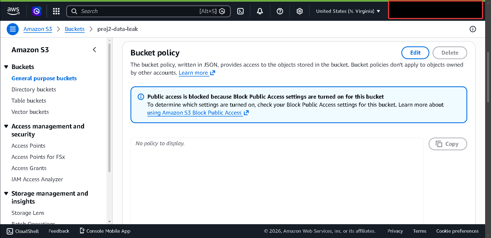

# AWS Identity Privilege Escalation & Incident Response Lab

## Overview
This project simulates a real-world AWS cloud security breach initiated by a misconfigured Identity and Access Management (IAM) policy. It demonstrates the complete attack lifecycle-from privilege escalation to data exfiltration-and showcases a DevSecOps-aligned detection pipeline using CloudTrail and CloudWatch, followed by manual Incident Response (IR) containment.

---

## Architecture & Attack Flow

---

## The Attack Lifecycle (Offense)

### 1. Privilege Escalation
**Objective:** Exploit `iam:CreateUser` and `iam:AttachUserPolicy` to establish a rogue administrative backdoor.

Using the compromised `proj2-attacker` credentials, I bypassed intended restrictions by creating a secondary administrative identity, `hacked-admin`.

<b>[Click to view proof of privilege escalation]</b>

 

**Step A: The Exploit (CLI)**

*Figure 13: Terminal output showing the successful creation of 'hacked-admin' via AWS CLI.*

**Step B: Verification (Console)**

*Figure 18: AWS Management Console confirming the existence of the unauthorized 'hacked-admin' identity.*

**The Root Cause: Toxic Policy**

*Figure 02: The misconfigured IAM policy that allowed the 'proj2-attacker' to escalate privileges.*

**Impact:** Complete account takeover achieved via a newly minted admin identity.

---

### 2. Data Exfiltration
**Objective:** Access and download sensitive credentials from a restricted S3 bucket using the `hacked-admin` backdoor.

Targeting the `proj2-data-leak` bucket, I used the AWS CLI to bypass intended security boundaries and retrieve the sensitive `passwords.txt` file.

<b>[Click to view definitive proof of exfiltration]</b>

 

**Step A: Identifying the Target**

*Figure 04: Locating the sensitive data-leak bucket in the S3 console.*

**Step B: The Breach (Terminal)**

*Figure 16: Terminal output confirming the successful sync and unauthorized viewing of 'passwords.txt'.*

**Impact:** **CRITICAL.** Unauthorized access to plaintext credentials, leading to potential lateral movement across the infrastructure.

## 3. Detection & Alerting (Defense)

### Intercepting Anomalies
**Objective:** Detect unauthorized identity creation using CloudWatch Metric Filters.

AWS CloudTrail logged the malicious `CreateUser` API call, which was intercepted by a pre-configured CloudWatch Metric Filter scanning for identity-based anomalies.

<b>[Click to view detection logic]</b>

 

*Figure 5: CloudWatch filter intercepting unauthorized user creation (`{ $.eventName = "CreateUser" }`).*

### Real-Time Alerting
**Objective:** Notify the security team instantly via Amazon SNS.

The Metric Filter triggered a CloudWatch Alarm, which immediately dispatched an incident notification via email.

<b>[Click to view triggered alerts]</b>

 

*Figure 6: The triggered CloudWatch Alarm.*

*Figure 7: Real-time Incident Response alert delivered to the security team.*

---

### 4. Incident Response & Remediation
**Objective:** Contain the threat and eradicate the compromised assets.

Upon receiving the real-time SNS alert, I initiated emergency containment protocols via the **AWS Management Console** to neutralize the threat and secure the cloud environment.

<b>[Click to view remediation & hardening proof]</b>

 

**Step A: Severing Rogue Access**
I manually revoked the compromised access keys and deleted the `hacked-admin` identity to prevent further unauthorized sessions.

**Step B: Hardening the Data Perimeter**

*Figure 22: Enforcing 'Block Public Access' via the S3 Console to permanently close the exfiltration vector.*

**Step C: Policy Cleanup**

*Figure 23: Removing the misconfigured public bucket policy to restore a secure baseline.*

**Impact:** Rogue access was completely severed, and the data perimeter was hardened, preventing future unauthorized public access.

## Tech Stack & Services Used
* **Identity & Security:** AWS IAM, AWS STS
* **Storage:** Amazon S3
* **Monitoring & Auditing:** AWS CloudTrail, Amazon CloudWatch
* **Notification:** Amazon SNS
* **Operations:** AWS CLI, Bash
