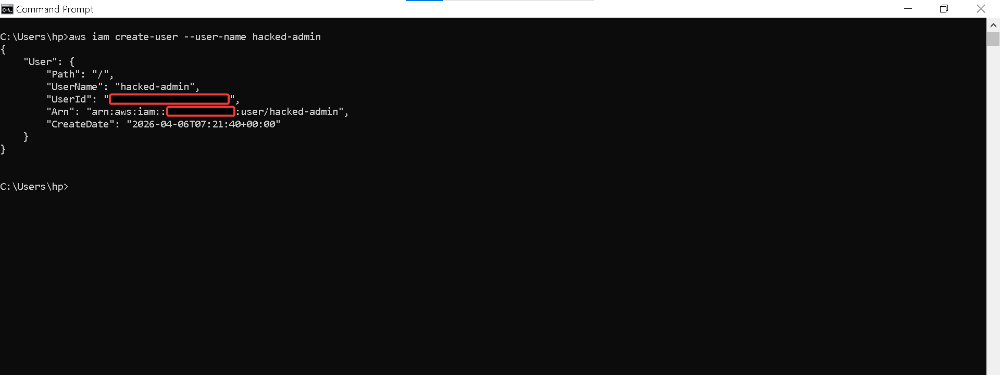
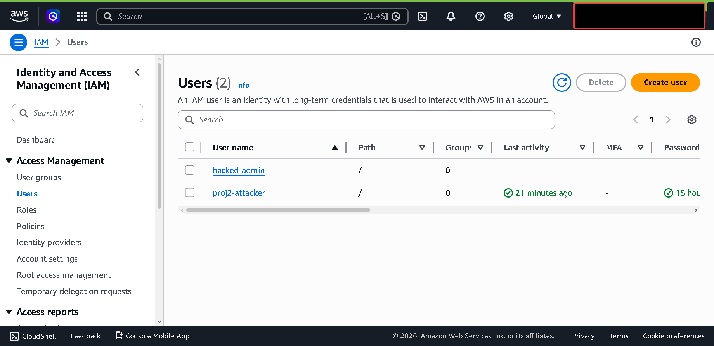
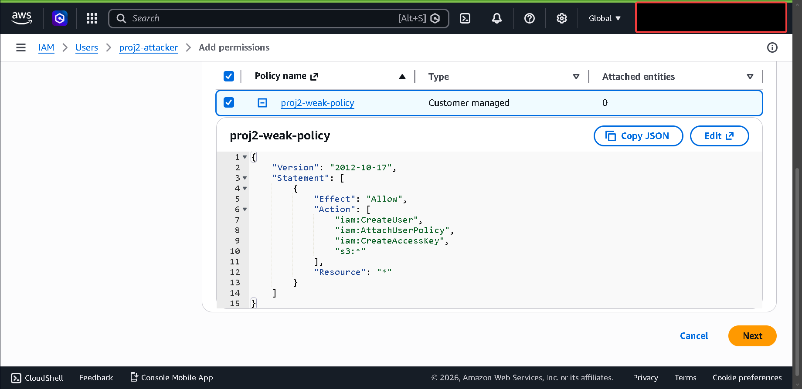
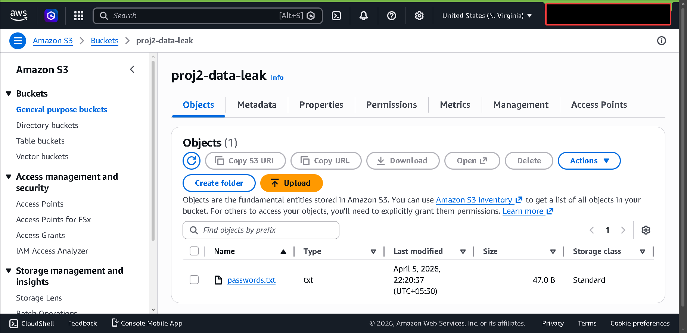
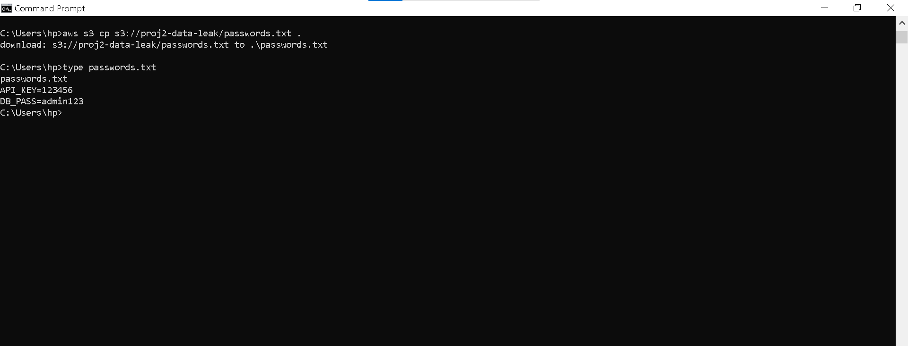
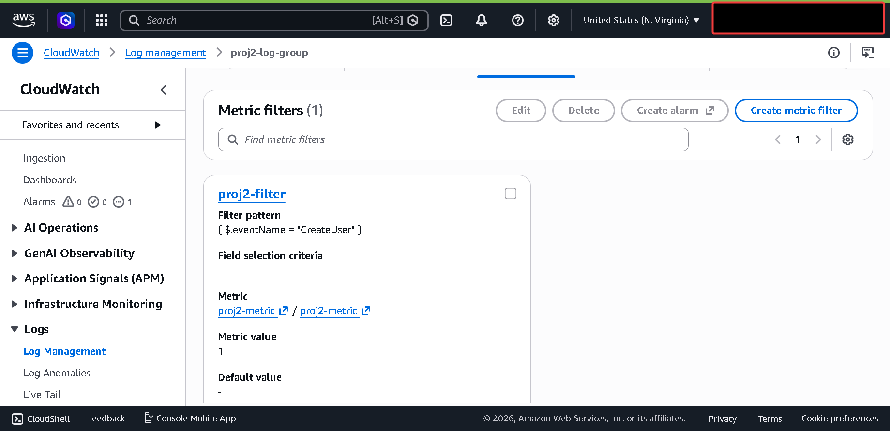
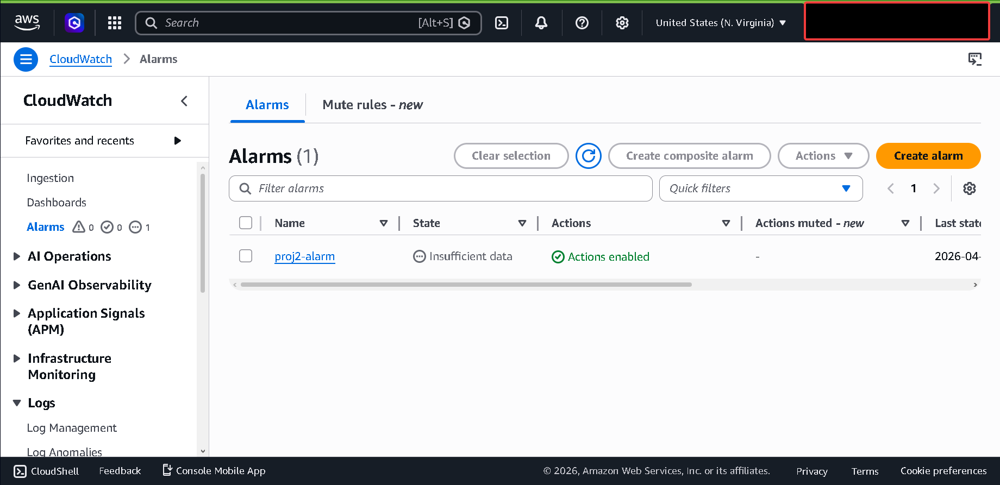
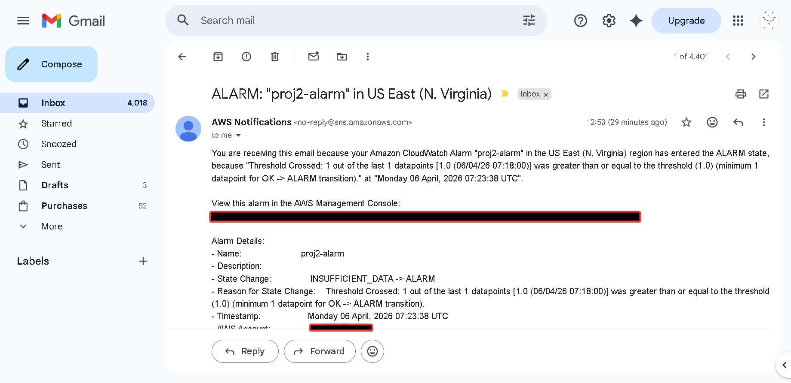
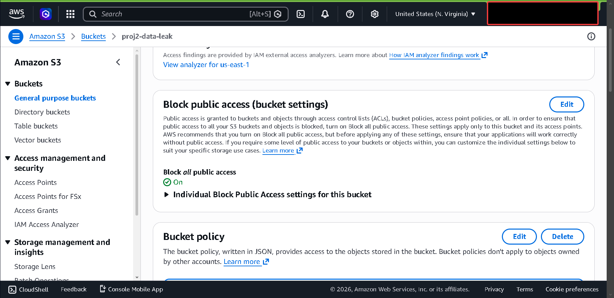

# AWS Identity Privilege Escalation & Incident Response Lab

## Overview
This project simulates a real-world AWS cloud security breach initiated by a misconfigured Identity and Access Management (IAM) policy. It demonstrates the complete attack lifecycle-from privilege escalation to data exfiltration-and showcases a DevSecOps-aligned detection pipeline using CloudTrail and CloudWatch, followed by manual Incident Response (IR) containment.

---

## Architecture & Attack Flow


---

## The Attack Lifecycle (Offense)

### 1. Privilege Escalation
**Objective:** Exploit `iam:CreateUser` and `iam:AttachUserPolicy` to establish a rogue administrative backdoor.

**Step A: The Exploit (CLI)**
Using the compromised `proj2-attacker` credentials, I executed the following commands to create a new user and bypass intended restrictions:


*Figure 13: Terminal output showing the successful creation of 'hacked-admin' via AWS CLI.*

**Step B: Verification (Console)**
The screenshot below confirms that the rogue user was successfully injected into the IAM environment with full privileges:


*Figure 18: AWS Management Console view confirming the existence of the unauthorized 'hacked-admin' identity.*


*Figure 2: The toxic IAM policy allowing privilege escalation.*
</details>

**Impact:** Complete account takeover achieved via a newly minted admin identity.
### 2. Data Exfiltration
**Objective:** Locate and extract sensitive data using the rogue admin keys.

With admin access secured, I scanned the environment for vulnerable storage and located the `proj2-data-leak` bucket, downloading its contents.
```bash
aws s3 ls s3://proj2-data-leak
aws s3 cp s3://proj2-data-leak/passwords.txt .
```

<details>
<summary><b>[Click to view proof of exfiltration]</b></summary>
<br>


*Figure 3: Identifying the exposed S3 bucket containing sensitive files.*


*Figure 4: Successful exfiltration of the passwords.txt payload via AWS CLI.*
</details>

**Impact:** Sensitive internal files successfully exfiltrated to the local attack machine.

---

## Detection & Alerting (Defense)

### 1. Intercepting Anomalies
**Objective:** Detect unauthorized identity creation using CloudWatch Metric Filters.

AWS CloudTrail logged the malicious `CreateUser` API call, which was intercepted by a pre-configured CloudWatch Metric Filter scanning for identity-based anomalies.

<details>
<summary><b>[Click to view detection logic]</b></summary>
<br>


*Figure 5: CloudWatch filter intercepting unauthorized user creation (`{ $.eventName = "CreateUser" }`).*
</details>
### 2. Real-Time Alerting
**Objective:** Notify the security team instantly via Amazon SNS.

The Metric Filter triggered a CloudWatch Alarm, which immediately dispatched an incident notification via email.

<details>
<summary><b>[Click to view triggered alerts]</b></summary>
<br>


*Figure 6: The triggered CloudWatch Alarm.*


*Figure 7: Real-time Incident Response alert delivered to the security team.*
</details>

---

## Incident Response & Remediation
**Objective:** Contain the threat and eradicate the compromised assets.

Upon receiving the SNS alert, immediate containment and eradication protocols were executed via the AWS CLI to neutralize the threat.

```bash
# 1. Neutralize the compromised identity
aws iam delete-access-key --user-name hacked-admin --access-key-id <ACCESS_KEY_ID>
aws iam detach-user-policy --user-name hacked-admin --policy-arn arn:aws:iam::aws:policy/AdministratorAccess
aws iam delete-user --user-name hacked-admin

# 2. Secure the data perimeter
aws s3api put-public-access-block --bucket proj2-data-leak --public-access-block-configuration BlockPublicAcls=true,IgnorePublicAcls=true,BlockPublicPolicy=true,RestrictPublicBuckets=true
```

<details>
<summary><b>[Click to view remediation proof]</b></summary>
<br>


*Figure 8: Securing the data perimeter by forcefully blocking public S3 access at the bucket level.*
</details>

**Impact:** Rogue access completely severed and data exfiltration vectors neutralized.

---

## Tech Stack & Services Used
* **Identity & Security:** AWS IAM, AWS STS
* **Storage:** Amazon S3
* **Monitoring & Auditing:** AWS CloudTrail, Amazon CloudWatch
* **Notification:** Amazon SNS
* **Operations:** AWS CLI, Bash
